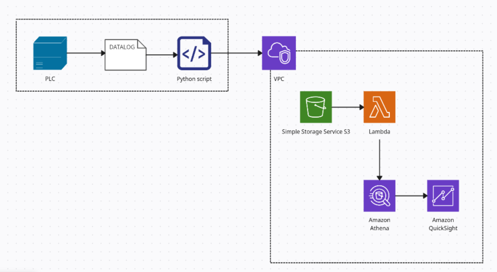
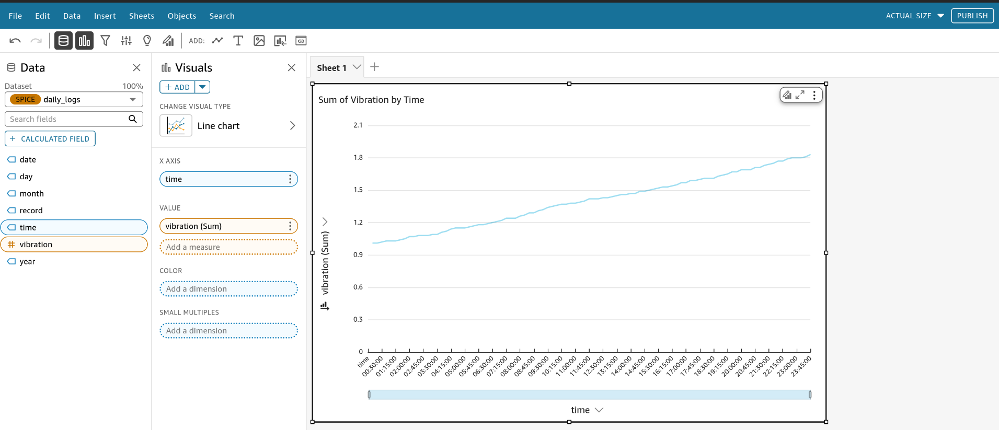

# PLC Data Pipeline - Vibration Analytics

This repository contains a complete **automated data pipeline** for collecting, processing, and analyzing vibration data from Programmable Logic Controllers (PLCs). The pipeline provides **near real-time data processing** that automatically ingests daily CSV logs, processes them through AWS services, and delivers fresh analytics data ready for consumption.

## Architecture Overview



*Complete data pipeline architecture showing the flow from PLC data generation through AWS services to QuickSight analytics*

```
PLC Device → Local CSV → Python Upload → S3 Bucket → Lambda Trigger → Athena Table Update → QuickSight Dashboard
```

### Data Flow

1. **Data Generation**: PLC creates daily vibration readings in CSV format
2. **Scheduled Data Ingestion**: Cron job runs Python script daily to upload CSV to S3 and clean up local files
3. **Data Processing**: Lambda function **automatically updates Athena table with fresh daily data**
4. **Data Analytics**: QuickSight consumes updated data for daily dashboards and analysis

## Pipeline Features

- **Automated Scheduling**: Cron job ensures daily data upload without manual intervention
- **Event-Driven Processing**: Automatic data processing triggered by S3 uploads
- **Daily Data Refresh**: Lambda ensures Athena table contains the latest vibration readings
- **Automated Cleanup**: Local files removed after successful upload
- **Partitioned Storage**: Optimized data organization for efficient querying
- **Daily Analytics**: Fresh data available for daily analysis and reporting

## Repository Structure

```
├── scripts/
│   ├── create_s3.py           # S3 bucket creation script
│   ├── upload_log.py          # Daily log upload script
│   ├── lambda_code.py         # Lambda function for Athena partition management
│   ├── athena_plc_analytics_DDL.sql  # Athena table schema
│   └── fake_datalog.py        # Vibration data simulator
├── images/
│   ├── quicksight-dashboard.png      # QuickSight dashboard screenshot
│   └── pipeline-architecture.png    # Pipeline architecture diagram
└── README.md                  # This file
```

## Quick Start

### Prerequisites

- AWS CLI configured with appropriate permissions
- Python 3.7+ with boto3 installed
- AWS services: S3, Athena, Lambda, QuickSight

### Setup Instructions

#### 1. Create S3 Bucket

```python
python scripts/create_s3.py
```

Update the `bucket_name` variable in the script with your desired bucket name.

#### 2. Create Athena Table

Execute the DDL script in AWS Athena console:

```sql
-- Run scripts/athena_plc_analytics_DDL.sql in Athena Query Editor
```

**Important**: Update the S3 bucket name in the DDL script to match your bucket.

#### 3. Deploy Lambda Function

- Create a new Lambda function in AWS Console
- Copy code from `scripts/lambda_code.py`
- Set up S3 trigger for object creation events on your bucket
- Update database and output bucket names in the code
- **Function Purpose**: Automatically updates Athena table with new daily data when CSV files are uploaded

#### 4. Configure Scheduled Data Upload

**Set up automatic daily uploads using cron job:**

1. Update `scripts/upload_log.py` with your bucket name
2. Configure cron job for scheduled execution:

```bash
# Edit crontab
crontab -e

# Add this line for daily upload at 6:00 AM
0 6 * * * /usr/bin/python3 /path/to/your/scripts/upload_log.py >> /var/log/plc_upload.log 2>&1

# Alternative schedules:
# Every hour: 0 * * * * /usr/bin/python3 /path/to/your/scripts/upload_log.py
# Weekdays at 8:30 AM: 30 8 * * 1-5 /usr/bin/python3 /path/to/your/scripts/upload_log.py
# Every 4 hours: 0 */4 * * * /usr/bin/python3 /path/to/your/scripts/upload_log.py
```

**Cron Job Format:** `minute hour day month day_of_week command`

**For Windows systems, use Task Scheduler instead:**
```cmd
schtasks /create /tn "PLC_Upload" /tr "python C:\path\to\scripts\upload_log.py" /sc daily /st 06:00
```

**Verify cron job:**
```bash
# List current cron jobs
crontab -l

# Check cron service status
sudo systemctl status cron
```

## Data Schema

The pipeline processes CSV files with the following structure:

| Column | Type | Description |
|--------|------|-------------|
| record | string | Record identifier |
| date | string | Date in YYYY-MM-DD format |
| time | string | Time in HH:MM:SS format |
| vibration | float | Vibration reading in mm/sec |

### Partitioning Strategy

Data is partitioned by date using the following S3 structure:
```
s3://your-bucket/plc-logs/year=YYYY/month=MM/day=DD/
```

This partitioning strategy optimizes query performance and reduces costs in Athena.

## Testing with Simulated Data

Use the `scripts/fake_datalog.py` script to generate test data:

### Interactive Mode
```python
python scripts/fake_datalog.py
```

### Programmatic Usage
```python
from scripts.fake_datalog import generate_vibration_csv

generate_vibration_csv(
    filename="test_vibration_data.csv",
    num_records=50,
    min_vibration=1.0,
    max_vibration=3.5,
    start_date="2025-06-26",
    start_time="08:00:00",
    interval_minutes=15
)
```

## Pipeline Operation

### Automated Daily Processing

The pipeline operates on a **fully automated daily cycle**:

1. **Daily Data Collection**: PLC generates daily vibration readings
2. **Scheduled Upload**: Cron job automatically runs `upload_log.py` at configured time (default: 6:00 AM)
3. **Immediate Processing**: Lambda function detects new file and updates Athena table
4. **Fresh Analytics**: Updated data becomes available in QuickSight for daily analysis

### Scheduling Configuration

**Default Schedule**: Daily at 6:00 AM
```bash
0 6 * * * /usr/bin/python3 /path/to/scripts/upload_log.py
```

**Common Alternative Schedules**:
- **Hourly**: `0 * * * *` - For high-frequency monitoring
- **Every 4 hours**: `0 */4 * * *` - Balanced frequency
- **Weekdays only**: `0 6 * * 1-5` - Business days only
- **Multiple times daily**: `0 6,14,22 * * *` - 3 times per day

### Data Freshness

- **Upload Schedule**: Daily at 6:00 AM (configurable via cron)
- **Processing Latency**: < 5 minutes after upload
- **Analytics Availability**: Daily refresh
- **Historical Data**: Retained with daily partitions for trend analysis

## Configuration

### Environment Variables

Set these variables in your environment or update the scripts directly:

- `BUCKET_NAME`: Your S3 bucket name
- `ATHENA_DATABASE`: Athena database name
- `ATHENA_OUTPUT_BUCKET`: S3 bucket for Athena query results

### AWS Permissions

The Lambda function requires the following IAM permissions:

```json
{
    "Version": "2012-10-17",
    "Statement": [
        {
            "Effect": "Allow",
            "Action": [
                "athena:StartQueryExecution",
                "athena:GetQueryExecution",
                "s3:GetObject",
                "s3:PutObject",
                "glue:GetTable",
                "glue:GetPartitions"
            ],
            "Resource": "*"
        }
    ]
}
```

## uickSight Integration

Once data is flowing through the pipeline:

1. Connect QuickSight to your Athena data source
2. Select the `plc_analytics.daily_logs` table
3. Create visualizations for:
   - Vibration trends over time
   - Daily/weekly/monthly aggregations
   - Anomaly detection dashboards
   - Equipment health monitoring

### Example Dashboard

The pipeline enables real-time vibration monitoring dashboards in QuickSight:



*Example: "Sum of Vibration by Time" line chart showing vibration trends throughout the day, with data automatically updated from your PLC logs*

**Key Dashboard Features:**
- **Daily Data Updates**: Charts update automatically as new daily data flows through the pipeline
- **Time-based Analysis**: Track vibration patterns across days, weeks, and months
- **Trend Detection**: Identify equipment performance trends and potential issues over time
- **Interactive Filtering**: Filter by date ranges, equipment zones, or vibration thresholds
- **Automated Email Reporting**: Schedule daily/weekly reports to be sent automatically to stakeholders

### Email Reporting

QuickSight supports automated email reporting for regular distribution of insights:

- **Scheduled Reports**: Set up daily, weekly, or monthly automated reports
- **Custom Recipients**: Send reports to equipment managers, maintenance teams, or executives
- **Dashboard Exports**: Automatically export charts and analysis as PDF attachments
- **Alert Notifications**: Configure threshold-based alerts for abnormal vibration readings

**Important**: Email subscriptions to external recipients (non-AWS users) require a **QuickSight subscription** to the service. Internal AWS users can receive reports without additional subscription costs.

## Monitoring and Troubleshooting

### Common Issues

1. **Cron job not executing**: Check cron service status and verify script path/permissions
2. **Lambda function not triggering**: Check S3 event configuration and permissions
3. **Table not updating with new data**: Verify Lambda execution logs in CloudWatch
4. **Athena queries returning stale data**: Check if Lambda completed successfully
5. **Upload errors**: Verify AWS credentials and S3 bucket permissions
6. **Missing daily data**: Ensure PLC is generating logs and cron job is running
7. **Permission errors**: Ensure cron job runs with appropriate user permissions

### Pipeline Monitoring

Monitor your data pipeline health:

- **Cron Logs**: Check `/var/log/plc_upload.log` for upload execution status
- **CloudWatch Logs**: Lambda execution details and errors
- **S3 Metrics**: Upload success rates and storage usage  
- **Athena Query History**: Data processing verification
- **QuickSight Refresh Status**: Dashboard data freshness

**Monitor cron job execution:**
```bash
# Check recent cron executions
grep CRON /var/log/syslog | tail -10

# Monitor upload log
tail -f /var/log/plc_upload.log
```

### Logging

All scripts include comprehensive logging. Monitor CloudWatch logs for Lambda function execution and table update status.

## Customization

### Adding New Metrics

To add additional sensor data:

1. Update the CSV structure in your PLC configuration
2. Modify the Athena DDL schema
3. Update the Lambda function if new partitioning is needed

### Changing Data Frequency

The pipeline supports any data collection frequency. Update the `interval_minutes` parameter in the data generation scripts.

## Best Practices

- **Cron Job Reliability**: Use absolute paths in cron jobs and redirect output to log files
- **Pipeline Reliability**: Monitor Lambda function success rates and set up alerts
- **Data Quality**: Validate CSV format before upload to prevent processing errors  
- **Error Handling**: Review both cron and Lambda logs regularly for processing issues
- **Cost Optimization**: Use appropriate Athena query patterns to minimize costs
- **Data Retention**: Plan S3 lifecycle policies for long-term data management
- **Security**: Follow AWS security best practices for S3 bucket policies and Lambda permissions
- **Backup Strategy**: Consider keeping local backups before file deletion in upload script

